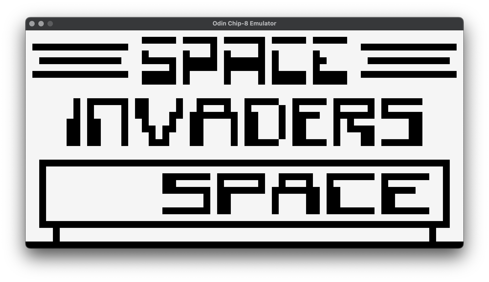

# odin-chip8

A [CHIP-8](https://en.wikipedia.org/wiki/CHIP-8) emulator written in [Odin](https://odin-lang.org/).



## Building and running

_Note:_ This has only been tested on macOS arm64, but it should work on all platforms on which Odin can run.

### Desktop

- Build the application.

```bash
make build-desktop
```

- Run the application and pass a ROM as the only positional argument.

```bash
./build/desktop/app.bin ../../roms/BRIX
```

### Web

_Note:_ The web build is currently hardcoded to the Space Invaders ROM.

- Build the application.

```bash
make build-web
```

- Run it.

```bash
cd build/web
python -m http.server # or your preferred method for running an HTTP server
```

- Navigate to `http://localhost:8000`

### As a library

Raylib is used as the frontend in the `app` package in this repository, however, there is no particular frontend implementation tied to the CHIP-8 library in `lib/chip8`. You could use the `chip8` package as an emulator library and add your own frontend with another graphics library in place of Raylib or the web build.

## Why?

I'm early in my Odin learning and emulators have begun to interest me, so it seemed like a great opportunity to combine the two.
Yes, there are many CHIP-8 emulators out there, but this one is mine written in Odin.

## Acknowledgements

- [Cowgod's technical reference](http://devernay.free.fr/hacks/chip8/C8TECH10.HTM) - _The_ technical reference.
- [CHIP-8 Rust book and ROMS](https://github.com/aquova/chip8-book) - This book was immensely helpful with great explanations and examples.
- [JavaScript blog post](https://www.freecodecamp.org/news/creating-your-very-own-chip-8-emulator/) - A useful blog post of an emulator written in JavaScript.
- [CHIP-8 ROM test suite](https://github.com/Timendus/chip8-test-suite) - Useful ROMS for testing your emulator.
- [Beep](https://opengameart.org/content/beep-tone-sound-sfx) - The beep sound from OpenGameArt.
- [Odin Raylib Web Template](https://github.com/karl-zylinski/odin-raylib-web) - Karl's amazing template for Odin Raylib apps on the web.

## License

[MIT](https://opensource.org/license/MIT)
